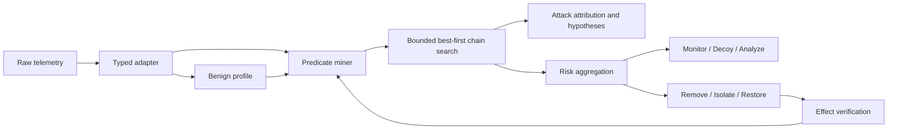

# Abstract

Autonomous cyber agents combine detection, attack-path reasoning, and response selection, yet it remains unclear which of these components transfer when telemetry schemas and action spaces change. We implement a shared deterministic core that normalizes observations into typed, stage-aware predicates and searches for causal chains using temporal proximity, shared context, stage progression, and mission impact. The core supports an offline attack-investigation orchestrator and an online defense orchestrator. We evaluate both on CAGE Challenge 4 and DARPA Transparent Computing (TC) E3/E5 under a frozen protocol: thresholds and chain rules are selected only on CADETS E3 development data, and test labels are loaded only after outputs are fixed.

On CADETS E3, grounded traces recover 17 malicious nodes among 530 inspected nodes, compared with 10 for a matched-budget anomaly-only baseline. The frozen method reproduces the attribution direction on THEIA E3, recovering 17 of 1,218 nodes versus 8. However, Average Precision does not improve on CADETS, and 196 nodes are reported on an attack-free THEIA day. On ClearScope E5, attribution reverses: the method recovers 4 of 522 malicious nodes versus 11 for anomaly-only. A preregistered CADETS ablation that removes event paths degrades chain attribution from 17/530 to 3/1,220. In two 100-pair CAGE evaluations, the scope-constrained defender improves reward over LayerChain by 468.65 points under official Red (95% CI: [276.24, 656.89]) and 595.39 under chain-aware Red ([410.39, 784.28]), while reducing all three attack-impact outcomes.

These results delimit rather than establish universal superiority: hierarchical chaining can improve E3 investigation priority when temporal and path context are preserved, but it does not by itself solve alert calibration, CDM20 transfer, or online response allocation.

**Keywords:** autonomous cyber defense, provenance graph, attack attribution, causal chain, CAGE Challenge 4, DARPA Transparent Computing

# 1 Introduction

Autonomous cyber defense requires an agent to interpret partial observations, infer the progression of an attack, and select actions that reduce mission loss without disrupting benign activity. CAGE Challenge 4 operationalizes this problem as a multi-agent defense task over a randomized enterprise network, while DARPA Transparent Computing (TC) exposes process, file, and network provenance for long-running attack investigation [@kiely2025environment; @darpa2020tc]. The tasks differ—online control versus offline attribution—but both require lifting low-level observations into meaningful stages and connecting individually ambiguous events over time.

Prior CAGE work has explored graph-based multi-agent reinforcement learning (MARL), hierarchical sub-policies, and rule-based state machines [@kiely2025challenge; @singh2025hmarl; @cybermonic2025code]. Provenance-based intrusion detection systems (PIDSs) combine self-supervised graph representation learning, temporal models, and dependency analysis to detect anomalies and reconstruct attack paths [@jia2024magic; @cheng2024kairos; @jiang2025orthrus]. Yet strong graph-level AUROC or F1 does not necessarily imply that an analyst receives a concise set of malicious entities. Moreover, inconsistent preprocessing, test-informed thresholding, and coarse labels can make cross-system comparisons misleading [@bilot2025simpler; @abrar2025reproducibility].

We study whether a common evidence–predicate–chain abstraction transfers across these two settings. The core deliberately excludes benchmark-specific hostnames, attack UUIDs, fixed action indices, and test labels. It feeds two task heads: an attack-investigation orchestrator that ranks provenance entities and proposes hypotheses, and a defense orchestrator that maps chain-aware risk to reversible or strong actions. Our goal is not to assume a universal improvement, but to identify the conditions under which the shared abstraction helps or fails.

We ask four research questions:

- **RQ1:** Does hierarchical trace reconstruction improve fine-grained attack attribution over the same anomaly detector without chaining?
- **RQ2:** Do the representation and search rules frozen on CADETS E3 transfer across performers and CDM versions?
- **RQ3:** Does a chain-aware risk orchestrator improve reward and attack suppression in CAGE Challenge 4?
- **RQ4:** When transfer fails, is the limiting factor chain construction, input representation, or action orchestration?

This paper makes four contributions:

1. We implement a deterministic typed-evidence and bounded best-first chain-search core shared by attack investigation and defense.
2. We define a leakage-resistant cross-benchmark protocol using benign-only profiles, validation-only thresholds, fine node-level ground truth, paired CAGE seeds, and preserved failed runs.
3. We reproduce a matched-budget attribution improvement on two E3 performers and a defense improvement against two Red policies while retaining negative intermediate and ClearScope E5 results.
4. We isolate two transfer boundaries: event-path loss in provenance attribution and evidence-to-action scope mismatch in online defense.

# 2 Background and Related Work

## 2.1 CAGE Challenge 4

CAGE Challenge 4 is a partially observable multi-agent cyber-defense environment. Blue agents can monitor and analyze hosts, deploy decoys, remove sessions, restore hosts, and control traffic between zones. They must suppress Red activity while preserving Green-user service availability [@kiely2025environment]. The published challenge analysis reports that three of the top four teams used heuristics and that topology inference and observation design substantially affected rankings under unseen scenario variants [@kiely2025challenge].

Cybermonic maintains a cumulative graph of hosts, routers, ports, files, and the Internet, and decomposes actions into node-, edge-, and global-level choices [@cybermonic2025code]. H-MARL divides defense into Investigate, Recover, and Control Traffic sub-policies selected by an expert or learned master policy [@singh2025hmarl]. We adopt the general principle of hierarchical action decomposition but do not reuse learned weights, privileged indicators, or fixed action indices. Our policy instead materializes report-derived risk bands and causal evidence as deterministic decisions, which makes negative behavior attributable to explicit rules.

## 2.2 Provenance-Based Detection and Investigation

DARPA TC records temporal interactions among processes, files, and network objects as a provenance graph. Engagement 3 uses CDM18, whereas Engagement 5 uses CDM20 and changes both performers and schemas. The official release explicitly warns that prototype-generated data are imperfect and that expected indicators may be missing [@darpa2020tc].

MAGIC uses masked graph representation learning and outlier detection for self-supervised APT detection [@jia2024magic]. KAIROS uses a temporal graph encoder–decoder to score events and link anomalous edges into attack graphs [@cheng2024kairos]. ORTHRUS combines node-level anomaly detection with dependency-based reconstruction and emphasizes Quality of Attribution (QoA), i.e., the analyst effort required to understand a detection [@jiang2025orthrus]. PIDSMaker-related work shows that complex neural PIDSs do not always outperform simpler systems and argues for standardized preprocessing, splits, labels, and metrics [@bilot2025simpler; @bilot2026pidsmaker].

Our anomaly-only comparator is not ORTHRUS. It is the same benign profile and node-scoring model with chain contributions removed, evaluated at the exact node budget emitted by our chain method. Public MAGIC scores are used only in a separate coarse-label robustness check. We therefore do not claim to outperform MAGIC, KAIROS, ORTHRUS, or PIDSMaker systems.

# 3 Method

## 3.1 Typed Evidence and Stage-Aware Predicates

An adapter normalizes each observation into typed evidence with time, layer, source, subject, relation, object, context, confidence, and provenance. Missing fields remain unknown rather than being treated as benign. Evidence is mapped into five stages:

| Stage | Meaning | TC examples | CAGE examples |
|---|---|---|---|
| ingress | access path formation | connect, receive | network/service discovery |
| trust break | identity or integrity boundary violation | execute, clone | exploit, suspicious process |
| lifecycle | execution or session maintenance | open, read | session, privilege |
| mission effect | effect on mission state | write, send | service impact |
| response | defensive intervention | not used | analyze, decoy, remove, restore |

For TC, the benign profile estimates three distributions: structural tuples \((source\ type, relation, target\ type)\), relation transitions within 18 seconds, and relation-conditioned path buckets. The anomaly score for event \(e\) is

\[
A(e)=0.50A_{\text{struct}}(e)+0.30A_{\text{trace}}(e)
+0.20A_{\text{path}}(e).
\]

Each component is a Laplace-smoothed log-surprise value normalized to [0,1]. We set the anomaly threshold to the 0.995 quantile of validation event scores. Test labels do not enter profile fitting or threshold selection.

Directly turning every anomalous event into a predicate causes repeated READ and WRITE activity to dominate the frontier. The grounded-trace representation instead identifies a process session as suspicious when at least one event exceeds the threshold, reconstructs its surrounding transitions within an 18-second window, and aggregates those transitions into one predicate per stage. Each predicate retains its strongest anomaly evidence, endpoints, relations, and path context.

## 3.2 Causal Edge Scoring and Bounded Search

For two predicates \(p_i\) and \(p_j\), we compute

\[
E_{ij}=0.30T_{ij}+0.30J_{ij}+0.25G_{ij}+0.15M_{ij},
\]

where \(T\) is temporal proximity within 18 seconds, \(J\) is Jaccard similarity over context, \(G\) rewards forward stage progression, and \(M\) rewards a transition into mission effect. If a factor is unobservable, its weight is redistributed over the observed factors rather than assigned a zero value.

We retain edges with \(E_{ij}\geq0.58\) and keep the top five outgoing edges per predicate. Bounded best-first search starts from ingress or trust-break predicates. A valid chain has length three to five, spans at least three distinct stages, and terminates at mission effect or response. Its score is

\[
S(C)=\operatorname{clip}\left(
0.55\bar{E}+0.20\bar{q}+0.05\bar{v}
+0.06|\mathcal{S}_C|+0.08I_{\text{mission}},0,1\right),
\]

where \(\bar{q}\) and \(\bar{v}\) are mean predicate confidence and severity, and \(\mathcal{S}_C\) is the set of stages in the chain. Scores, lengths, and stable chain identifiers define a deterministic ordering.

For TC, we cap each day at 2,048 predicates and report the top 48 chains. These limits are frozen during CADETS development and are not changed per external performer.

## 3.3 Attack-Investigation Orchestrator

The attack-side pipeline invokes a Profiler, Predicate Miner, Chain Builder, Experiment Planner, Constraint Validator, Campaign Scheduler, and Frontier Explorer. In the TC evaluation, it does not execute exploits. It emits investigation nodes, candidate chains, and baseline, single-factor, pairwise, combined, negative-control, and high-risk hypotheses. A constraint check removes concepts that are absent from the observed relation space.

Node ranking and chain attribution are evaluated separately. Copying the full chain score to every endpoint can inflate large session footprints. We therefore cap each node contribution at \(S(C)\times confidence(p)\) for the predicate that supports it. The primary attribution comparison selects the top anomaly-only nodes at exactly the number of unique nodes emitted by the chains.

## 3.4 Defense Orchestrator

The defender follows a Perceive–Detect–Decide–Respond–Recover loop. For predefined evidence, it computes

\[
R_{\text{rule}}=0.35q+0.25v+0.25c+0.15k,
\]

and for an observed benign-profile deviation,

\[
R_{\text{deviation}}=0.50a+0.30c+0.20k.
\]

Here \(q\), \(v\), \(c\), \(k\), and \(a\) denote confidence, severity, cross-evidence correlation, target criticality, and adjusted anomaly magnitude. When both risks are available, the policy takes their maximum.

Risk below 0.50 maps to Monitor; 0.50–0.69 maps to a decoy or Analyze; 0.70–0.84 maps to temporary isolation; and risk at least 0.85 is considered for block or restore after checking independent evidence layers and asset criticality. Decoys are placed dynamically on an observed benign host in the threatened zone rather than deployed in a fixed initial sweep. Decoy contact re-enters the evidence stream as a trust-break predicate.

Strong actions are verified through subsequent state changes and recurrence rather than API acknowledgement. The Recovery-Reflex guard is intended to prevent an adversary from inducing an expensive restore through a weak, attacker-controlled signal.

# 4 Experimental Design

## 4.1 Leakage and Selection Controls

We separate development, validation, and final evaluation. The common core contains no malicious UUID, attack time, host-name rule, dataset-specific bonus, or fixed CAGE action index. Failed versions and unfavorable seeds are retained. Test labels are loaded only after all outputs for a split are fixed. CAGE confidence intervals use 10,000 bootstrap resamples of paired run-level differences with a fixed analysis seed. Fine TC nodes are causally dependent, so we report descriptive counts and do not treat nodes as independent samples for significance tests.

## 4.2 CAGE Setup

We use official CAGE Challenge 4 commit `8c3c50ca54b176c2de199847944e8dcc035497e3`, 500 steps per episode, official `FiniteStateRedAgent`, and a separately implemented chain-aware Red policy. The initial frozen defender failed on 100 paired seeds 5400–5499 with reward difference -564.72 [-812.21, -319.86], and that result is retained. Before implementing v12, we registered development 12400–12419, validation 13400–13419, and final 14400–14499. The final comparison evaluates only LayerChain and v12 on 100 paired seeds under each Red policy.

After observing the final result, we did not reselect on those seeds. We preregistered a new development block, seeds 6400–6419, for two response-allocation diagnostics. Neither met its selection condition, so reserved validation seeds 7400–7419 and final seeds 8400–8499 remain unopened.

## 4.3 DARPA TC Setup

CADETS E3 uses benign training days 3, 4, 5, 7, 8, 9, and 10; validation day 2; and development days 6, 11, 12, and 13. We freeze grounded trace v4 before applying it unchanged to THEIA E3, using benign days 2–5, validation day 9, and test days 10, 12, and 13. ClearScope E5 follows the public PIDSMaker split: benign days 8 and 9, validation day 11, and test days 14, 15, and 17.

Fine node UUID ground truth comes from the public ORTHRUS/PIDSMaker release. We report AUROC and Average Precision (AP) for anomaly-only and chain-grounded node scores; chain precision and recall at a matched node budget; and chain output on attack-free days. A robustness experiment using public MAGIC anomaly scores and ThreaTrace coarse labels is kept separate from fine-label results.

The evaluation universe contains 297,085 CADETS nodes with 68 covered positives, 701,622 THEIA nodes with 118 positives, and 150,964 ClearScope E5 nodes with 51 positives. The CADETS index covers 68 of 72 public fine-label UUIDs (94.44%); recall therefore uses covered positives as its denominator. THEIA and E5 label coverage is 100%.

# 5 Results

## 5.1 RQ1: E3 Attack Attribution

| Dataset | Method | AUROC | AP | Inspected | Malicious | Precision | Recall |
|---|---|---:|---:|---:|---:|---:|---:|
| CADETS E3 | anomaly-only | 0.78705 | 0.126001 | 530 | 10 | 0.01887 | 0.14706 |
| CADETS E3 | grounded trace | 0.79144 | 0.125996 | 530 | 17 | 0.03208 | 0.25000 |
| THEIA E3 | anomaly-only | 0.83723 | 0.028519 | 1,218 | 8 | 0.00657 | 0.06780 |
| THEIA E3 | grounded trace | 0.84664 | 0.028947 | 1,218 | 17 | 0.01396 | 0.14407 |

On CADETS, grounded traces recover seven additional malicious nodes at the same investigation budget. AUROC increases by 0.00439, while AP decreases by 0.000005 and is effectively unchanged. On THEIA, the frozen method recovers 17 malicious nodes instead of 8; AUROC and AP increase by 0.00941 and 0.000428. Precision and recall at top 100, 500, and 1,000 remain unchanged, so the result does not establish a better top-\(k\) detector.

The attribution improvement does not yield a low-false-positive alert. The method reports 108 nodes on attack-free CADETS day 11 and 196 on attack-free THEIA day 13. An exploratory 0.995 validation chain-score calibration reduces volume but still leaves attack-free outputs and misses the entire THEIA day-10 attack. RQ1 is therefore supported only for fixed-budget investigation priority.

## 5.2 RQ2: CDM20/E5 Transfer

| Method | AUROC | AP | Inspected | Malicious | Precision | Recall |
|---|---:|---:|---:|---:|---:|---:|
| anomaly-only | 0.52672 | 0.023037 | 522 | 11 | 0.02107 | 0.21569 |
| grounded trace | 0.54243 | 0.023052 | 522 | 4 | 0.00766 | 0.07843 |

On ClearScope E5, the frozen method forms 97 valid chains and raises AUROC by 0.01572. Nevertheless, matched-budget attribution falls from 11 malicious nodes to 4. The AP increase is only 0.000014, all reported top-\(k\) metrics are unchanged, and five nodes are emitted on attack-free day 14. We reject CDM20 attribution transfer.

The public PIDSMaker E5 event table does not contain the original `predicateObjectPath`. We keep path unknown rather than reconstructing it from labels, application names, or node paths. Without retuning or rerunning E5, we execute one preregistered CADETS counterfactual in which path alone is removed from train, validation, and development events.

| CADETS diagnostic | Original path | Path removed |
|---|---:|---:|
| grounded-trace AUROC | 0.791443 | 0.733838 |
| grounded-trace AP | 0.125996 | 0.085902 |
| chain-reported nodes | 530 | 1,220 |
| malicious chain nodes | 17 | 3 |
| matched anomaly malicious nodes | 10 | 12 |

The number of chains (192) and predicates (8,192) remains unchanged, but the attribution advantage reverses and the investigation footprint broadens. Path is therefore not merely an auxiliary feature; it constrains both the benign profile and predicate context. This CADETS ablation cannot identify path loss as the sole E5 cause because performer, operating system, CDM version, and path availability change together.

## 5.3 RQ3: CAGE Defense

| Red policy | Blue agent | Reward | Privileged hosts | Impacted hosts | Successful Impact |
|---|---|---:|---:|---:|---:|
| official | LayerChain | -3110.39 ± 815.63 | 35.12 | 8.30 | 8.31 |
| official | scope v12 | -2641.74 ± 746.69 | 32.28 | 7.41 | 7.46 |
| chain-aware | LayerChain | -3703.61 ± 983.85 | 35.50 | 6.58 | 6.64 |
| chain-aware | scope v12 | -3108.22 ± 814.13 | 33.35 | 5.53 | 5.56 |

Under official Red, v12 minus LayerChain reward is +468.65 [276.24, 656.89], paired effect size 0.483, and win rate 0.67. Privileged hosts, impacted hosts, and successful Impact decrease by 2.84 [-4.13, -1.61], 0.89 [-1.55, -0.26], and 0.85 [-1.51, -0.21].

Under chain-aware Red, reward improves by +595.39 [410.39, 784.28], effect size 0.624, and win rate 0.72. Privileged hosts, impacted hosts, and Impact decrease by 2.15 [-3.24, -1.04], 1.05 [-1.66, -0.45], and 1.08 [-1.70, -0.47]. All four intervals favor v12 under both policies.

The negative trajectory is retained: v6 scores -564.72 [-812.21, -319.86], uses 10,448 Analyze, 5,554 DeployDecoy, and 4,975 Remove actions versus LayerChain's 19,686, 7,093, and 5; v9 loses 2,738.65 points, and v10 remains 457.45 points below LayerChain [-909.91, -35.22]. v12 changes policy structure rather than risk weights by aligning action scope with evidence scope and suppressing repeated strong actions.

## 5.4 RQ4: Transfer Boundaries

Chain existence is insufficient evidence of useful transfer. ClearScope E5 produces chains, but those chains expand more benign than malicious nodes. Conversely, a static-graph adapter over public MAGIC scores produces no valid chains on THEIA or TRACE because the preprocessed graph lacks the temporal session structure required by our representation.

In CAGE, the initial mapping from evidence to action is mismatched. A recent-event bit is not persistent state, and process-level Remove does not cover process-plus-connection evidence. Scope constraints and recurrence verification close this boundary for the two evaluated Red policies.

# 6 Discussion

## 6.1 What Transfers

CADETS and THEIA use different operating systems and provenance collectors but preserve CDM18 event paths and temporal sessions. Under those conditions, the same stage mapping, 18-second window, edge threshold, maximum depth, and grounded node contribution improve matched-budget attribution in the same direction. The strongest supported claim is therefore narrow: when temporal session and path context are preserved, hierarchical traces can improve E3 investigation priority across performers.

## 6.2 What Does Not Transfer

Attribution is not detection. Attack-free footprints and failed calibration prevent us from treating chain membership as a low-false-positive alert. Chain creation is also not synonymous with high QoA: E5 produces 97 chains but worse attribution than anomaly-only. Interpretable risk scores alone do not guarantee effective control; response scope and event semantics must be modeled explicitly.

## 6.3 Claim Boundary

We do not claim that the framework:

- outperforms public CAGE agents or Red policies beyond the two evaluated here;
- outperforms MAGIC, KAIROS, ORTHRUS, or PIDSMaker systems;
- transfers to CDM20/E5 or every provenance performer;
- produces a calibrated low-false-positive alert stream; or
- uses an LLM for action selection or beats a prompt-only LLM.

The contribution is instead a reproducible shared core, a two-performer E3 attribution result, a two-policy CAGE improvement over an internal baseline, preservation of unsuccessful variants, and an explicit diagnosis of representation and action-scope boundaries.

# 7 Limitations and Threats to Validity

1. LayerChain is an internal baseline, not a rerun of a top public CAGE submission.
2. The final CAGE experiment covers the default and one chain-aware Red policy; it does not cover all published stealth, aggression, phishing, or decoy-detection variants.
3. Matched anomaly-only uses our own benign profile with chaining removed, not a state-of-the-art neural PIDS under identical preprocessing and compute.
4. Fine malicious nodes are few and causally dependent. We do not assign statistical significance to TC node counts.
5. The relation-to-stage mapping is attack-label agnostic but still encodes domain knowledge about the CDM event vocabulary.
6. ClearScope E5 changes performer, OS, schema, and path availability simultaneously, preventing single-factor causal attribution.
7. The attack-side agent produces provenance hypotheses and investigation priorities; it does not execute a live network exploit.
8. No LLM API is used, so the study contains no prompt-only LLM baseline.
9. Matched-budget malicious-node recovery is only a proxy for analyst effort; no human analyst study is performed.

# 8 Conclusion

We apply a common typed-evidence, predicate, and causal-chain core to attack investigation and autonomous defense. The method improves matched-budget malicious-node recovery on CADETS and THEIA E3, but does not improve CADETS AP and emits broad attack-free footprints. On ClearScope E5, chain formation persists while attribution degrades. In CAGE, scope-constrained response improves reward and every attack-impact outcome over a simpler internal baseline under two Red policies.

Hierarchical causal chaining is therefore not a universal performance layer. It is useful when rich temporal and semantic context is preserved and when its output is treated as investigation priority. Future work should separately evaluate schema-independent context representations, analyst-budget-aware calibration, and a learned master policy that explicitly models action duration and mission cost, each under fresh development and external evaluation splits.

# Reproducibility

The artifact records benchmark and reference-code commits, all data splits, frozen constants, failed versions, per-run CAGE results, fine-label TC outputs, and SHA-256 identifiers for the result files supporting the manuscript. The full protocol is in `docs/protocol.md`; aggregate and raw results are in `results/`; and `paper/check.py` verifies the reported quantitative values. One hundred fifty unit and integration tests pass across the split workstation environments. No exposed API credential is used or stored.
