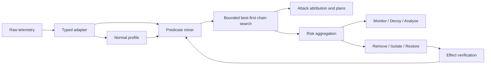

# 초록

자율 사이버 에이전트 연구는 탐지, 공격 경로 추론, 대응 선택을 하나의 시스템으로 결합하지만, 각 구성요소가 데이터와 행동 공간이 바뀌어도 일반화되는지는 충분히 검증되지 않았다. 본 연구는 관측을 계층화된 predicate로 정규화하고, 시간 근접성·문맥 공유·단계 진행·임무 영향을 이용해 인과 체인을 탐색하는 공통 코어를 구현한다. 동일 코어 위에 오프라인 공격 체인 발굴 오케스트레이터와 온라인 방어 오케스트레이터를 구성하고, CAGE Challenge 4와 DARPA Transparent Computing(TC) E3/E5에서 평가했다. 모든 임계값과 체인 규칙은 CADETS E3 개발 범위에서 고정했으며, 정답 라벨은 출력 고정 후 지표 계산에만 사용했다.

CADETS E3에서 제안한 grounded trace는 530개 조사 노드 중 악성 노드 17개를 회수해 동일 예산 anomaly-only의 10개보다 높은 attribution을 보였다. 동결된 방법을 THEIA E3에 적용했을 때도 1,218개 중 17개를 회수해 anomaly-only의 8개보다 높았다. 그러나 node-ranking AP는 CADETS에서 개선되지 않았고, 공격 없는 THEIA 구간에도 196개 노드가 보고됐다. ClearScope E5에서는 522개 중 4개만 회수해 anomaly-only의 11개보다 낮았다. 별도의 CADETS path 제거 진단에서 체인 attribution이 17/530에서 3/1,220으로 악화됐다. CAGE의 두 100-pair 최종 평가에서 범위 제약 방어 v12는 LayerChain보다 공식 Red reward를 +468.65 [276.24, 656.89], 체인형 Red reward를 +595.39 [410.39, 784.28] 개선하고 세 공격 영향 지표를 모두 낮췄다.

결과는 계층적 체이닝이 E3의 조사 우선순위에는 기여할 수 있지만 탐지 calibration, CDM20 표현 전이, 온라인 행동 오케스트레이션을 자동으로 해결하지는 못함을 보여준다. 본 연구는 성공 결과뿐 아니라 선택되지 않은 버전과 외부 일반화 실패를 함께 보존함으로써 자율 사이버 에이전트의 적용 경계를 제시한다.

**주요어:** autonomous cyber defense, provenance graph, attack attribution, causal chain, CAGE Challenge 4, DARPA Transparent Computing

# 1. 서론

자율 사이버 방어는 부분 관측 환경에서 위협을 탐지하고, 공격의 진행 상태를 추론하며, 임무 손실을 최소화하는 대응을 선택해야 한다. CAGE Challenge 4는 여러 Blue agent가 무작위 기업 네트워크를 분담해 방어하는 환경을 제공하고, DARPA Transparent Computing은 프로세스·파일·네트워크 객체 사이의 provenance event를 통해 장기간 공격을 분석할 수 있게 한다 [@kiely2025environment; @darpa2020tc]. 두 벤치마크는 각각 온라인 행동 선택과 오프라인 공격 조사라는 다른 문제를 다루지만, 낮은 수준의 관측을 의미 있는 단계로 올리고 시간적으로 연결된 증거를 조합해야 한다는 공통점이 있다.

최근 CAGE 연구는 그래프 기반 MARL, 계층적 sub-policy, 규칙 기반 상태기계 등 다양한 오케스트레이션을 제안했다 [@kiely2025challenge; @singh2025hmarl; @cybermonic2025code]. Provenance 기반 침입 탐지 연구는 self-supervised graph representation, temporal graph network, dependency analysis를 이용해 이상 탐지와 공격 경로 복원을 결합한다 [@jia2024magic; @cheng2024kairos; @jiang2025orthrus]. 그러나 높은 AUROC나 graph-level F1만으로는 분석가가 실제로 조사해야 할 노드 수와 악성 원인 회수율을 알기 어렵다. 또한 서로 다른 전처리, test 기반 threshold 선택, coarse label 사용은 시스템 간 비교를 왜곡할 수 있다 [@bilot2025simpler; @abrar2025reproducibility].

본 연구는 특정 벤치마크의 호스트 이름이나 공격 UUID를 규칙으로 넣는 대신, 공통 evidence–predicate–chain 표현을 두 과업에 적용한다. 목표는 모든 환경에서 우월하다는 것을 가정하는 것이 아니라 다음 질문을 검증하는 것이다.

- **RQ1:** 계층적 trace와 인과 체인이 anomaly-only보다 세밀한 공격 attribution을 제공하는가?
- **RQ2:** CADETS E3에서 고정한 표현과 탐색 규칙이 다른 performer와 CDM 버전으로 전이되는가?
- **RQ3:** 같은 증거·체인 코어를 사용한 위험 기반 방어 오케스트레이션이 CAGE reward와 공격 영향을 개선하는가?
- **RQ4:** 일반화 실패가 발생할 때 체인 생성, 입력 표현, 행동 오케스트레이션 중 어느 경계에서 실패하는가?

본 연구의 기여는 다음과 같다.

1. 서로 다른 사이버 과업을 동일한 typed evidence, 5단계 predicate, 제한된 best-first chain search로 연결하는 결정론적 코어를 구현했다.
2. 정상 구간 학습, validation-only threshold, fine node ground truth, paired seed 평가를 결합한 교차 벤치마크 실험 규약을 제시했다.
3. CADETS와 THEIA E3에서 matched-budget attribution 개선을 재현하고, 두 Red 정책에서 내부 방어 baseline을 개선하면서 실패한 중간 버전과 ClearScope E5 결과도 보존했다.
4. path 제거 반사실 실험과 CAGE 범위 제약 실험을 통해 표현 계약과 evidence-to-action 범위가 일반화의 핵심 경계임을 확인했다.

# 2. 배경 및 관련 연구

## 2.1 CAGE Challenge 4

CAGE Challenge 4는 부분 관측 Dec-POMDP 형태의 다중 에이전트 방어 환경이다. Blue agent는 Monitor, Analyse, Remove, Restore, DeployDecoy와 zone 간 통신 제어를 사용하며, Red agent의 침투와 Impact를 억제하면서 정상 사용자의 서비스 가용성을 유지해야 한다 [@kiely2025environment]. 공개 결과에서는 상위 네 팀 중 세 팀이 heuristic이었고, topology 추론과 관측 표현의 차이가 agent 순위에 큰 영향을 주었다 [@kiely2025challenge].

Cybermonic은 host, router, port, file, internet을 누적 그래프로 표현하고 행동을 node·edge·global 수준으로 분해했다 [@cybermonic2025code]. H-MARL은 Investigate, Recover, Control Traffic sub-policy와 이를 선택하는 master policy를 학습했다 [@singh2025hmarl]. 본 연구는 이러한 계층적 행동 분해를 참고하지만 PPO 가중치, 확장 IOC, 고정 action index는 사용하지 않는다. 대신 보고서에서 정의한 위험 구간과 인과 체인을 결정론적 정책으로 물질화해 각 선택의 실패 원인을 직접 추적한다.

## 2.2 Provenance 기반 공격 탐지와 조사

DARPA TC의 provenance graph는 프로세스, 파일, 네트워크 객체와 이들의 상호작용을 시간순으로 기록한다. E3는 CDM18, E5는 CDM20을 사용하며 performer와 schema가 함께 변한다. 공식 배포 문서도 연구 prototype이 생성한 데이터가 불완전할 수 있음을 명시한다 [@darpa2020tc].

MAGIC은 masked graph representation learning과 outlier detection으로 self-supervised APT 탐지를 수행한다 [@jia2024magic]. KAIROS는 temporal graph encoder–decoder로 event anomaly를 계산하고 이상 edge를 attack graph로 결합한다 [@cheng2024kairos]. ORTHRUS는 node-level anomaly와 dependency 기반 attack reconstruction을 결합하면서 Quality of Attribution(QoA)을 강조한다 [@jiang2025orthrus]. PIDSMaker 계열 연구는 복잡한 PIDS가 항상 단순한 모델보다 낫지 않으며, 전처리와 평가 규약을 통일해야 공정한 비교가 가능하다고 지적한다 [@bilot2025simpler; @bilot2026pidsmaker].

본 연구의 anomaly-only는 ORTHRUS 모델이 아니라, 동일한 정상 profile에서 체인 결합만 제거한 내부 대조군이다. MAGIC 공개 점수는 별도 coarse-label 강건성 검사에서만 사용한다. 따라서 본 연구는 MAGIC, KAIROS 또는 ORTHRUS의 보고 성능을 능가한다고 주장하지 않는다.

# 3. 방법

## 3.1 공통 evidence와 predicate

관측 \(e\)를 시각, 계층, 출처, 주체, 관계, 객체, context, confidence, provenance로 구성된 typed evidence로 정규화한다. 관측되지 않은 필드는 정상으로 대체하지 않고 `unknown`으로 유지한다. Evidence는 다음 5단계 predicate로 변환된다.

| 단계 | 의미 | TC 예시 | CAGE 예시 |
|---|---|---|---|
| ingress | 접근 경로 형성 | connect, recv | network/service discovery |
| trust_break | 신뢰·권한 경계 손상 | execute, clone | exploit, suspicious process |
| lifecycle | 실행·세션 유지 | open, read | session, privilege |
| mission_effect | 임무 영향 | write, send | service impact |
| response | 방어 개입 | 해당 없음 | analyse, decoy, remove, restore |

TC의 정상 profile은 구조 \((source\ type, relation, target\ type)\), 18초 이내 relation 전이, relation별 path bucket의 빈도를 학습한다. 각 event의 이상 점수는

\[
A(e)=0.50A_{\mathrm{struct}}(e)+0.30A_{\mathrm{trace}}(e)+0.20A_{\mathrm{path}}(e)
\]

로 계산한다. 각 항은 Laplace smoothing된 정상 확률의 로그 surprise를 [0,1]로 정규화한 값이다. Validation event score의 0.995 quantile을 threshold로 고정한다. Test label은 이 과정에 사용하지 않는다.

원시 이상 event를 직접 체인 노드로 사용하면 반복 READ·WRITE가 후보를 지배한다. Grounded trace는 threshold를 넘은 event가 하나 이상 있는 프로세스의 18초 세션을 복원하고, 세션 안의 전이를 단계별 predicate로 집계한다. Predicate confidence는 세션의 이상 근거를 유지하고 endpoint, relation, path context를 함께 보존한다.

## 3.2 인과 체인 탐색

두 predicate \(p_i,p_j\)의 edge 점수는

\[
E_{ij}=0.30T_{ij}+0.30J_{ij}+0.25G_{ij}+0.15M_{ij}
\]

로 계산한다. \(T\)는 18초 창 안의 시간 근접성, \(J\)는 context Jaccard 유사도, \(G\)는 공격 단계의 순방향 진행, \(M\)은 mission effect 연결이다. 어떤 요소를 관측할 수 없으면 0점으로 두지 않고 나머지 가중치를 비례 정규화한다.

Edge threshold는 0.58이며 predicate당 상위 5개 outgoing edge를 유지한다. 탐색은 ingress 또는 trust_break에서 시작하는 bounded best-first search다. 최대 길이는 5이고, 유효 체인은 predicate와 고유 단계가 각각 3개 이상이며 mission_effect 또는 response에서 종료되어야 한다. 체인 점수는

\[
S(C)=\operatorname{clip}(0.55\bar{E}+0.20\bar{q}+0.05\bar{v}
+0.06|\mathcal{S}_C|+0.08I_{\mathrm{mission}},0,1)
\]

로 계산한다. 여기서 \(\bar{q}\)와 \(\bar{v}\)는 predicate confidence와 severity 평균이다. 동일 입력에서 결과가 재현되도록 score, 길이, chain ID 순으로 결정론적 정렬을 사용한다.

TC에서는 일자별 predicate를 최대 2,048개로 제한하고 상위 48개 체인을 출력한다. 이 상한은 CADETS 개발 단계에서 고정했으며 외부 performer별로 바꾸지 않는다.

## 3.3 공격 체인 발굴 오케스트레이터

공격 측 오케스트레이터는 Profiler, Predicate Miner, Chain Builder, Experiment Planner, Constraint Validator, Campaign Scheduler, Frontier Explorer의 순서로 동작한다. TC 평가에서 출력은 실제 exploit이 아니라 조사할 node, chain, 실험 가설이다. Baseline, single, pairwise, combined, negative, high-risk 계획을 만들되 현재 relation 공간에서 실행 불가능한 개념은 제거한다.

Node ranking과 chain attribution은 분리한다. 체인 score를 endpoint score로 그대로 복사하면 넓은 session footprint가 과대평가될 수 있으므로, node별 체인 기여를 \(S(C)\times confidence(p)\)로 제한한다. 주 평가는 체인이 보고한 노드 수와 동일한 예산에서 anomaly-only 상위 노드가 회수한 악성 node 수를 비교한다.

## 3.4 방어 오케스트레이터

방어는 Perceive–Detect–Decide–Respond–Recover 순환으로 구성된다. Predicate confidence, severity, chain correlation, 자산 criticality를 다음과 같이 결합한다.

\[
R_{\mathrm{rule}}=0.35q+0.25v+0.25c+0.15k
\]

\[
R_{\mathrm{deviation}}=0.50a+0.30c+0.20k
\]

정상 이탈 정보가 있으면 두 위험도의 최대값을 사용한다. 위험도 0.50 미만은 Monitor, 0.50–0.69는 honeypot 또는 Analyse, 0.70–0.84는 임시 격리, 0.85 이상은 독립 계층 근거와 criticality를 확인한 뒤 block 또는 restore 후보로 보낸다.

Honeypot은 episode 시작에 고정 배치하지 않고 현재 위협과 같은 zone에서 관측된 정상 host 중 다음 전이 후보에 배치한다. 접촉은 trust_break predicate로 다시 입력된다. 강한 대응은 API 성공 응답이 아니라 이후 관측 변화와 재발 여부로 검증한다. 이 Recovery-Reflex guard는 공격자가 약한 신호로 비용이 큰 복구를 유도하는 것을 줄이기 위한 것이다.

# 4. 실험 설계

## 4.1 과적합 방지

실험은 개발, 검증, 최종 평가를 분리했다. 호스트 이름, 악성 UUID, 공격 시각, 데이터셋 전용 relation 보너스를 공통 코어에 넣지 않았다. 실패 버전과 불리한 seed를 제거하지 않았으며 test label은 agent 출력이 고정된 뒤 metric 계산에만 읽었다. CAGE paired confidence interval은 고정 seed의 run-level 차이를 10,000회 bootstrap해 계산했다. TC의 fine malicious node는 독립 표본이 아니므로 node 수를 이용한 유의성 검정은 하지 않고 기술 통계로 보고한다.

## 4.2 CAGE

공식 CAGE Challenge 4 commit `8c3c50ca54b176c2de199847944e8dcc035497e3`, episode당 500 step, 공식 `FiniteStateRedAgent`와 별도로 구현한 체인형 Red를 사용했다. 초기 동결 방어는 seed 5400–5499에서 LayerChain보다 -564.72 [-812.21, -319.86] 낮았고 이 결과를 보존했다. v12 구현 전 개발 12400–12419, 검증 13400–13419, 최종 14400–14499를 등록했다. 최종 평가는 두 Red 정책 각각에서 LayerChain과 v12만 100 paired seed로 비교했다.

최종 결과를 본 뒤 기존 seed에서 재선택하지 않았다. 행동 배분 실패를 조사하기 위해 새 개발 seed 6400–6419를 사전등록하고 v9, v10을 평가했다. 두 버전 모두 사전 선택 조건을 통과하지 못해 예약한 검증 seed 7400–7419와 최종 seed 8400–8499는 열지 않았다.

## 4.3 DARPA TC

CADETS E3는 정상 학습 3·4·5·7·8·9·10일, validation 2일, 개발 6·11·12·13일을 사용했다. Grounded trace v4를 고정한 뒤 THEIA E3의 정상 2·3·4·5일, validation 9일, test 10·12·13일에 수정 없이 적용했다. ClearScope E5는 PIDSMaker의 공개 분할을 따라 정상 8·9일, validation 11일, test 14·15·17일을 사용했다.

Fine ground truth는 ORTHRUS/PIDSMaker 공개 UUID를 사용했다. AUROC와 Average Precision(AP)은 anomaly-only score와 chain-grounded score를 비교한다. Attribution은 체인 node precision·recall과 동일 node budget의 anomaly-only precision·recall을 비교한다. 공격 없는 날의 보고 node 수도 별도로 측정한다. MAGIC의 공개 anomaly score와 ThreaTrace coarse label 실험은 fine-label 결과와 합치지 않는다.

평가 universe는 CADETS 297,085개 node와 covered positive 68개, THEIA 701,622개 node와 positive 118개, ClearScope E5 150,964개 node와 positive 51개다. CADETS는 공개 fine label 72개 중 68개를 인덱스에서 찾았으므로 label coverage가 94.44%이며 recall 분모는 covered positive다. THEIA와 E5의 label coverage는 100%다.

# 5. 결과

## 5.1 RQ1: E3 공격 attribution

| 데이터 | 방법 | AUROC | AP | 조사 노드 | 악성 노드 | Precision | Recall |
|---|---|---:|---:|---:|---:|---:|---:|
| CADETS E3 | anomaly-only | 0.78705 | 0.126001 | 530 | 10 | 0.01887 | 0.14706 |
| CADETS E3 | grounded trace | 0.79144 | 0.125996 | 530 | 17 | 0.03208 | 0.25000 |
| THEIA E3 | anomaly-only | 0.83723 | 0.028519 | 1,218 | 8 | 0.00657 | 0.06780 |
| THEIA E3 | grounded trace | 0.84664 | 0.028947 | 1,218 | 17 | 0.01396 | 0.14407 |

CADETS에서 grounded trace는 동일 조사 예산에서 악성 node를 7개 더 회수했다. AUROC는 0.00439 증가했지만 AP는 0.000005 감소해 ranking 개선으로 볼 수 없다. THEIA에서는 악성 node가 8개에서 17개로 증가하고 AUROC와 AP도 각각 0.00941, 0.000428 증가했다. 그러나 top-100·500·1000 precision과 recall은 변하지 않았다.

두 performer에서 matched-budget attribution 방향은 같았지만 낮은 오탐 경보는 달성하지 못했다. 공격이 없는 CADETS day 11과 THEIA day 13에 각각 108개, 196개 chain node가 보고됐다. Validation chain-score 0.995 quantile을 적용한 탐색적 calibration도 공격 없는 날의 출력을 제거하지 못했고 THEIA day 10 공격을 전부 놓쳤다. 따라서 RQ1은 조사 우선순위에 한해 지지되며, detector superiority로 확장되지 않는다.

## 5.2 RQ2: CDM20/E5 전이

| 방법 | AUROC | AP | 조사 노드 | 악성 노드 | Precision | Recall |
|---|---:|---:|---:|---:|---:|---:|
| anomaly-only | 0.52672 | 0.023037 | 522 | 11 | 0.02107 | 0.21569 |
| grounded trace | 0.54243 | 0.023052 | 522 | 4 | 0.00766 | 0.07843 |

ClearScope E5에서 97개 유효 체인이 형성됐고 AUROC는 0.01572 증가했다. 그러나 핵심 attribution은 악성 node 11개에서 4개로 악화됐다. AP 증가는 0.000014에 불과하고 top-k 지표는 모두 동일했다. 공격 없는 day 14에도 5개 node가 보고됐다. 따라서 CDM20 attribution 전이 가설을 기각한다.

공개 PIDSMaker E5 event table에는 원본 `predicateObjectPath`가 없었다. 이를 사후 복원하지 않고 모든 path를 unknown으로 유지했다. E5를 다시 튜닝하지 않고 CADETS의 모든 분할에서 path만 제거한 진단을 한 번 수행했다.

| CADETS 진단 | 원본 path | path 제거 |
|---|---:|---:|
| grounded trace AUROC | 0.791443 | 0.733838 |
| grounded trace AP | 0.125996 | 0.085902 |
| 체인 조사 node | 530 | 1,220 |
| 체인 악성 node | 17 | 3 |
| matched anomaly 악성 node | 10 | 12 |

체인 수 192개와 predicate 수 8,192개는 같았지만 attribution 우위가 역전됐다. Path는 단순 부가 feature가 아니라 predicate context와 정상 profile을 제한하는 표현 계약이었다. 다만 E5에서는 performer, OS, CDM version과 path availability가 함께 바뀌므로 이 진단만으로 path 손실을 유일한 원인으로 단정하지 않는다.

## 5.3 RQ3: CAGE 방어

| Red 정책 | Blue agent | Reward | Privileged host | Impacted host | Successful Impact |
|---|---|---:|---:|---:|---:|
| 공식 | LayerChain | -3110.39 ± 815.63 | 35.12 | 8.30 | 8.31 |
| 공식 | 범위 제약 v12 | -2641.74 ± 746.69 | 32.28 | 7.41 | 7.46 |
| 체인형 | LayerChain | -3703.61 ± 983.85 | 35.50 | 6.58 | 6.64 |
| 체인형 | 범위 제약 v12 | -3108.22 ± 814.13 | 33.35 | 5.53 | 5.56 |

공식 Red에서 v12 minus LayerChain reward는 +468.65 [276.24, 656.89], paired effect size 0.483, win rate 0.67이었다. Privileged host, impacted host, successful Impact는 각각 -2.84 [-4.13, -1.61], -0.89 [-1.55, -0.26], -0.85 [-1.51, -0.21]였다.

체인형 Red에서 reward는 +595.39 [410.39, 784.28], effect size 0.624, win rate 0.72였다. 세 공격 영향 지표는 -2.15 [-3.24, -1.04], -1.05 [-1.66, -0.45], -1.08 [-1.70, -0.47]이었다. 두 정책의 네 지표 모두 신뢰구간 전체가 v12 개선 방향이다.

실패 경로도 보존한다. v6은 -564.72 [-812.21, -319.86]이었고 Analyse 10,448회, DeployDecoy 5,554회, Remove 4,975회를 실행한 반면 LayerChain은 19,686회, 7,093회, 5회였다. v9은 2,738.65점 악화됐고 v10도 LayerChain보다 -457.45 [-909.91, -35.22] 낮았다. v12는 위험 가중치를 조정하지 않고 행동 범위를 증거 범위에 맞추며 강한 조치의 반복을 억제해 이 실패를 구조적으로 수정했다.

## 5.4 RQ4: 실패 경계

실험은 체인 생성 여부만으로 일반화를 판정하면 안 된다는 점을 보여준다. E5에서는 체인이 생성됐지만 attribution이 악화됐다. 반대로 MAGIC 정적 그래프 어댑터는 THEIA와 TRACE에서 높은 공개 anomaly score를 재현했지만 유효 체인을 하나도 만들지 못했다. 시간·세션 정보가 없는 정적 representation은 체인 탐색의 입력 계약을 충족하지 못했다.

CAGE에서는 초기 evidence-to-action mapping이 맞지 않았다. Process·connection bit는 지속 감염 state가 아니며 process-level Remove는 process와 connection을 함께 지목하는 증거 범위를 덮지 못했다. 행동 범위 제약과 재발 확인은 평가한 두 Red 정책에서 이 경계를 해소했다.

# 6. 논의

## 6.1 무엇이 일반화됐는가

CADETS와 THEIA는 OS와 수집기가 다르지만 CDM18 event path와 시간 정보를 보존한다. 이 조건에서 같은 relation-stage mapping, 18초 window, edge threshold, chain 길이와 node contribution이 matched-budget attribution을 같은 방향으로 개선했다. 따라서 본 방법의 가장 강한 경험적 주장은 “path와 temporal session이 보존된 E3 performer 사이에서 chain-based investigation priority가 전이됐다”는 것이다.

## 6.2 무엇이 일반화되지 않았는가

첫째, attribution은 detection이 아니다. 공격 없는 날의 넓은 footprint와 calibration 실패 때문에 본 시스템을 저오탐 alert detector로 부를 수 없다. 둘째, 체인 생성은 높은 QoA를 보장하지 않는다. E5 체인은 악성 node보다 정상 node를 더 많이 확장했다. 셋째, 설명 가능한 위험 점수만으로는 좋은 control policy가 되지 않으며 행동 범위와 event semantics를 명시적으로 모델링해야 한다.

## 6.3 논문 주장 범위

본 연구는 다음을 주장하지 않는다.

- CAGE에서 공개 상위 agent 또는 평가하지 않은 Red 정책까지 능가한다.
- MAGIC, KAIROS, ORTHRUS보다 높은 탐지 성능을 달성한다.
- E5/CDM20 또는 모든 provenance performer에 일반화한다.
- chain node를 실시간 경보로 사용하면 낮은 false-positive rate를 얻는다.
- LLM이 공격·방어 행동을 직접 선택하거나 LLM baseline보다 우수하다.

대신 결정론적 계층·체인 코어의 재현 가능한 구현, E3 attribution의 두-performer 전이, 두 Red 정책에서 내부 baseline 대비 CAGE 개선, 실패를 숨기지 않은 교차 벤치마크 평가를 기여로 제시한다.

# 7. 한계와 타당성 위협

본 연구에는 다음 한계가 있다.

1. CAGE의 LayerChain은 내부 baseline이며 공식 대회 제출물을 동일 환경에서 재실행한 결과가 아니다.
2. 최종 CAGE 평가는 기본 Red와 하나의 체인형 Red를 포함하지만 stealthy, aggressive, phishing 변형 전체를 평가하지 않았다.
3. TC matched anomaly-only는 동일 정상 profile의 체인 제거 대조군이다. State-of-the-art neural PIDS와 동일 전처리·계산 예산의 직접 비교가 아니다.
4. Fine-label 공격 사례 수가 적고 node는 서로 독립인 표본이 아니다. 따라서 TC 결과에 통계적 우월성을 부여하지 않는다.
5. Relation-stage mapping은 공격 UUID에 의존하지 않지만 CDM event vocabulary에 대한 도메인 설계를 포함한다.
6. ClearScope E5에서는 performer, OS, schema와 path availability가 동시에 변해 단일 원인 식별이 불가능하다.
7. 공격 오케스트레이터는 provenance 기반 가설·조사 계획을 출력하며 실제 네트워크 exploit을 수행하지 않는다.
8. LLM API를 사용하지 않았으므로 prompt-only LLM과의 비교는 포함하지 않는다.
9. QoA는 동일 조사 node budget의 악성 node 회수로 근사했으며 실제 SOC 분석가의 시간이나 이해도를 측정하지 않았다.

# 8. 결론

본 연구는 하나의 계층적 evidence–predicate–chain 코어를 자율 공격 조사와 방어 오케스트레이션에 적용했다. CADETS와 THEIA E3에서는 동일 조사 예산에서 악성 node 회수가 증가했지만, ranking 개선은 제한적이고 공격 없는 구간의 출력이 남았다. ClearScope E5에서는 체인이 형성됐음에도 attribution이 악화됐다. CAGE에서는 범위 제약 방어가 두 Red 정책 모두에서 LayerChain보다 reward와 모든 공격 영향 지표를 개선했다.

따라서 계층적 인과 체이닝은 범용적인 성능 향상 장치가 아니라, 충분한 temporal·semantic context가 보존되고 출력이 조사 우선순위로 사용될 때 유효한 구성요소다. 향후 연구는 schema-independent context representation, analyst-budget-aware calibration, 행동 비용을 명시적으로 최적화하는 learned master policy를 각각 독립된 개발·외부 평가 분할에서 검증해야 한다.

# 재현성 부록

- CAGE 공식 commit: `8c3c50ca54b176c2de199847944e8dcc035497e3`
- Cybermonic 참고 commit: `2afd652d80ce9d4051a07c23c2538f3dec6bb6c6`
- MAGIC 참고 commit: `aa0b647eea74b6faa0e52eb444370c4411a32cbe`
- ORTHRUS 참고 commit: `e7f25dfee1ddd182a955b88f8a90a8cbd4a8e543`
- PIDSMaker `velox` 참고 commit: `54f687c54aa03e5519cf44953d5ee44f5f6a4a28`
- 전체 규약: `docs/protocol.md`
- 집계 결과: `results/results.json`
- 실패 버전 포함 원시 결과: `results/`
- 결과 파일 무결성 인덱스: `paper/artifacts.json`
- 구현 검증: 분리된 워크스테이션 환경에서 150개 unit/integration test 통과

코드에는 benchmark 이름, 악성 UUID, test label을 이용한 점수 규칙이 없으며 노출된 API key는 사용하거나 저장하지 않았다.
